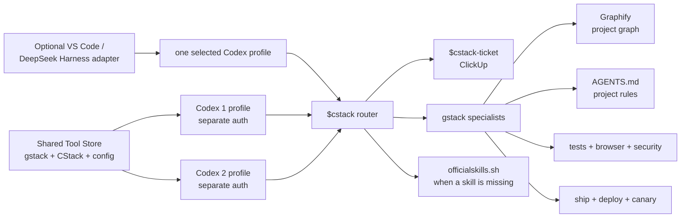
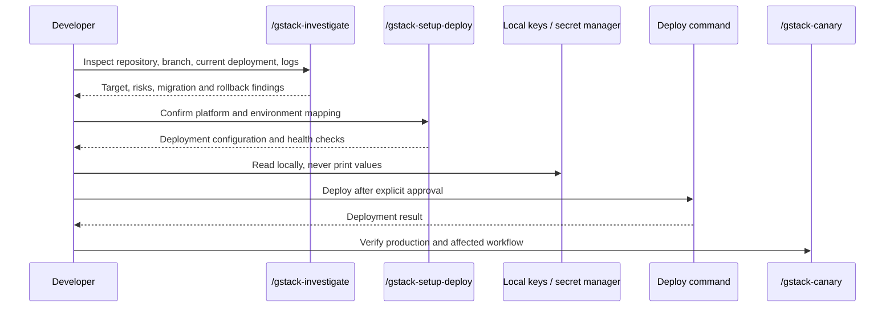

# Cherkani Agent Project Template

[](https://developers.openai.com/codex/)
[](https://github.com/garrytan/gstack)
[](https://github.com/graphify)
[](https://clickup.com/)

Reusable project instructions and setup scripts for a disciplined Codex development environment.

The design is intentionally simple:

```text
CStack = Cherkani-specific routing and ClickUp
gstack = primary planning, coding, QA, security, docs, and release workflow
Graphify = repository structure and dependency understanding
AGENTS.md = project rules and local operating contract
officialskills.sh = discovery source for missing specialist skills
```

## How It Fits Together



Codex1 and Codex2 share installed tools and sanitized configuration through `CODEX_SHARED_HOME`, while their authentication remains separate. Profile launchers may point both accounts at shared non-auth state, but they must not run concurrently against shared SQLite or session files. DeepSeek Harness is optional and should call one selected profile; it is not required and does not merge account context.

## New Laptop Setup

Prerequisites:

- Git
- Codex CLI on `PATH`
- Node.js and Bun for gstack
- `uv` for Graphify installation
- Access to your ClickUp account

Run from a clone of this repository:

```bash
./scripts/setup-machine.sh
```

This installs or updates:

- gstack and its complete prefixed skill catalog
- CStack router, ticket, and skill-discovery skills
- reviewed UI, security, testing, Supabase, Vercel, and accessibility skills
- shared Codex configuration
- Graphify tooling when `uv` is available

DeepSeek Harness is not a prerequisite. Use it only if you specifically want its VS Code panel or provider routing.

The default shared home is:

```text
~/.codex_shared
```

Use another location when needed:

```bash
CODEX_SHARED_HOME=/path/to/shared-home ./scripts/install-codex-shared.sh
```

Authenticate accounts separately. Connect ClickUp interactively on each laptop. Credentials, memories, sessions, and runtime databases are never cloned by this repository.

## Add A Project

Run:

```bash
./scripts/bootstrap-project.sh /absolute/path/to/project
```

The bootstrap script:

- adds `AGENTS.md` only when one does not already exist;
- installs Graphify project-scoped when available;
- registers Graphify guidance and hooks;
- adds `graphify-out/` to `.gitignore`;
- preserves existing project instructions.

After bootstrapping, replace the `REPLACE_*` values in `AGENTS.md` and configure the project scripts, URLs, production branch, ClickUp mapping, and deployment path.

## Daily Development

Start every meaningful task with:

```text
$cstack
```

CStack reads the project instructions, Git state, Graphify map, scripts, and available skills. It chooses the appropriate gstack workflow.

Create or find work in ClickUp with:

```text
$cstack-ticket
```

Then use gstack as the primary workflow:

```text
/gstack-autoplan          # large feature planning
/gstack-plan-eng-review   # architecture and technical plan
implement the approved plan
/gstack-health            # quality checks
/gstack-qa                # application QA and regression fixes
/gstack-cso               # security-sensitive work
/gstack-review             # pre-merge review
```

For a small change, use the smallest useful path:

```text
$cstack
implement the fix
/gstack-health
/gstack-review
```

## Skill Discovery

When a needed capability is not already installed:

```text
$cstack-discover <capability>
```

The discovery workflow:

1. Searches `https://officialskills.sh/` first.
2. Inspects the linked source repository.
3. Checks maintainer authority, maintenance, compatibility, permissions, overlap, and adoption.
4. Recommends the best fit based on evidence.
5. Asks before installing anything.

It does not bulk-install the 1000+ skill catalog.

## Verification And Documentation

Use:

```text
/gstack-qa
/gstack-qa-only       # report only, no fixes
/gstack-browse        # browser interaction
/gstack-review
/gstack-cso
/gstack-document-generate
/gstack-document-release
```

Graphify is updated after code changes:

```bash
graphify update .
graphify query "where is appointment authorization enforced?"
graphify affected "src/path/to/changed-file.ts"
```

## Branch And Release Flow

```mermaid
flowchart LR
    T[ClickUp task] --> F[feature/task-id-slug]
    F --> P["/gstack-autoplan"]
    P --> B[Implement]
    B --> Q["/gstack-qa + /gstack-review"]
    Q --> D[PR into develop]
    D --> R[Release inventory]
    R --> S["/gstack-ship"]
    S --> M[Approved promotion]
    M --> L["/gstack-land-and-deploy"]
    L --> C["/gstack-canary"]
    C --> PROD[Production]
```



Rules:

- Start from `develop`.
- Use `feature/<clickup-task-id>-<short-slug>` when a ClickUp task exists.
- Open feature PRs into `develop`.
- Do not work directly on `develop` or production.
- Use `/gstack-ship` for feature delivery.
- Compare `develop` with production before promotion.
- Use `/gstack-land-and-deploy` only after explicit approval.
- Use `/gstack-canary` and smoke tests after deployment.

See [config/release-workflow.md](config/release-workflow.md).

## Deployment And Local Keys



Before deployment, run `/gstack-investigate` and `/gstack-setup-deploy`. Use local `.env` files, an SSH agent, platform CLI login, or the configured secret manager. Never print, commit, upload, or add key values to ClickUp, logs, documentation, or agent instructions.

## Security Model

- Codex1 and Codex2 keep separate authentication files.
- Shared state contains tools and configuration, not credentials.
- Telemetry is disabled in the installed gstack configuration.
- Checkpoints are explicit; automatic WIP pushes are disabled.
- Codex cross-review is enabled.
- gstack pre-push secret protection is enabled.
- CStack ClickUp writes require explicit user intent.
- Existing ClickUp tasks are never modified, reassigned, closed, or deleted without identification and approval.
- Supabase, authentication, upload, webhook, and payment changes require focused security checks.

No system can guarantee secret safety. Review commands that access external services and keep deployment credentials out of chat.

## Repository Structure

```text
.
├── AGENTS.md                         # rules for maintaining this template
├── templates/AGENTS.md               # project guide copied into new repositories
├── skills/cstack/                    # project-aware router
├── skills/cstack-ticket/             # ClickUp conventions
├── skills/cstack-discover/           # official skill discovery and ranking
├── scripts/setup-machine.sh          # complete machine setup
├── scripts/install-codex-shared.sh   # gstack + selected skills + CStack
├── scripts/install-cstack.sh         # CStack-only refresh
├── scripts/bootstrap-project.sh      # project Graphify and AGENTS setup
├── config/cstack-workflows.md        # routing map
├── config/skills-manifest.md         # selected skills and sources
├── config/integrations.md            # ClickUp and account boundaries
└── config/release-workflow.md        # release evidence and deployment rules
```

## Troubleshooting

Skill not visible:

```bash
CODEX_SHARED_HOME="$HOME/.codex_shared" ./scripts/install-codex-shared.sh
```

gstack skills stale:

```text
/gstack-upgrade
```

Graphify missing:

```bash
uv tool install --upgrade 'graphifyy[sql]'
./scripts/bootstrap-project.sh /absolute/path/to/project
```

Deployment unclear:

```text
/gstack-investigate
/gstack-setup-deploy
```

## Files That Must Never Be Committed

```text
auth.json
memories_*.sqlite
sessions/
.env
.env.*
graphify-out/
deployment key files
```

Keep project-specific private values in the target project's local configuration. This public template remains anonymous and portable.
